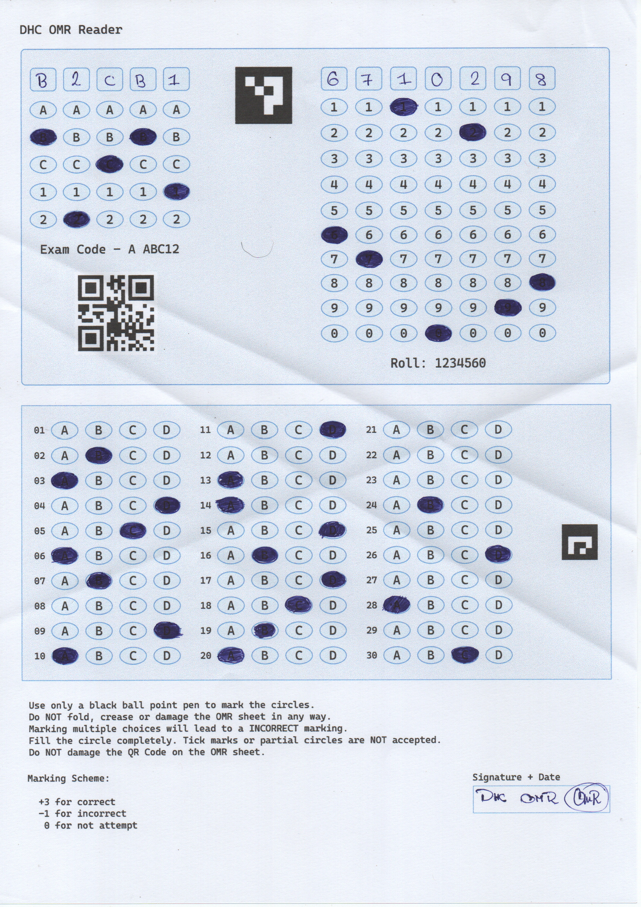

# OMR Parsing

This is a project to tinker around with [OpenCV](https://opencv.org/). It aims
to 'parse' OMR sheets and record the information

Currently the OMR sheets are generated using Inkscape. Processing of scanned
OMR copies work 90% of the time, the preprocessing of the images still need
work.

The OMR sheets contains a QR code which can be used for identification and 2
ArUco markers.


# How to run ?

You need to install `opencv-python` and `numpy`

## Trying with given samples:

Samples are located in the [samples directory](./res/samples/)

```console
# Generating template
python main.py template res/omr.png res/omr.template

# Parsing a sample OMR
python main.py parse res/samples/omr_with_bubbles.jpg res/omr.template

# Parsing a sample OMR with some folds
python main.py parse res/samples/omr_with_folds.jpg res/omr.template
```


## Generating template:

```console
python main.py template omr.png omr.template
```

Here `omr.png` is a "soft-copy" of the OMR sheet, `omr.template` will contain the relative positions of markers on the OMR (QRCode and the 2 ArUco codes) and bubbles.

> NOTE: You can print `omr.png` in a A4 sized paper, fill it out and scan it in 300 dpi (2580x3507) for parsing. Automatic resizing of scanned images is being worked on.

## Parsing OMR

```console
python main.py parse image.png omr.template
```

Here `image.png` is the scanned OMR image

# Example

Given a OMR sheet like this: 

running the script gives a output like so:

```console
OMR ID: 1234569420
Exam Code: B2CB1
Roll Code: 6710298
2:  B
3:  A
4:  D
5:  C
6:  A
7:  B
9:  D
10: A
11: D
13: A
14: A
15: D
16: B
17: D
18: C
19: B
20: A
24: B
26: D
28: A
30: C
Marks:
        - Correct:     6
        - Incorrect:   15
        - Total marks: 3
```

Here OMRID is the parsed value of the QR Code. 

The answers are marked using the following marking scheme:
- Correct:   +3
- Incorrect: -1

# License

Currently licensed under [GPL3](./LICENSE)
